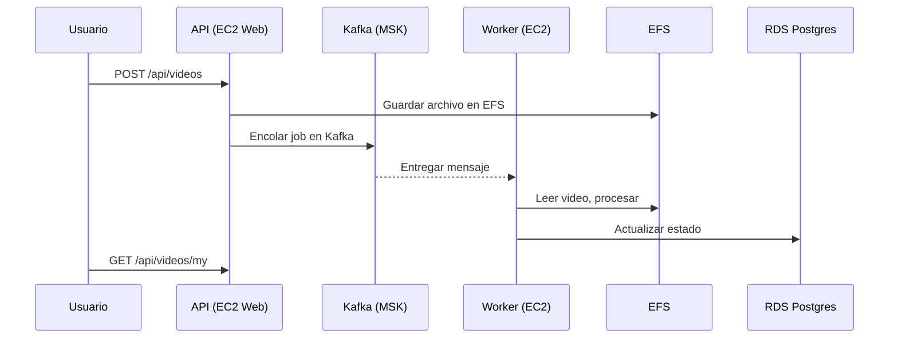

# Plan de Pruebas de Carga — Plataforma anb (AWS)

## 1. Objetivos
- Medir la **capacidad de procesamiento (throughput)**, **tiempos de respuesta** y **utilización de recursos** del sistema `anb-platform` desplegado en AWS bajo diferentes niveles de concurrencia.  
- Validar **rutas críticas** del usuario (API web) y un **flujo batch** (procesamiento asíncrono vía Kafka).  
- Establecer **criterios de aceptación (SLO/SLI)** y documentar resultados, hallazgos y mejoras.

---

## 2. Alcance
- **Incluye**: API (Go + Gin), frontend (React), worker de procesamiento (Kafka), base de datos (RDS PostgreSQL), reverse proxy (Nginx), almacenamiento (EFS).  
- **Excluye**: pruebas funcionales exhaustivas, seguridad ofensiva y pruebas E2E de UI visual.

---

## 3. Entorno de Pruebas

### 3.1 Topología
- **AWS Region**: us-east-1 (ejemplo).  
- **VPC** con subnets públicas y privadas.  
- **Balanceo**: Application Load Balancer (ALB).  
- **EC2 Web**: t3.micro (Nginx + API).  
- **EC2 Worker**: t3.micro (2 contenedores worker).  
- **Almacenamiento**: Amazon EFS montado en Web/Worker.  
- **Mensajería**: Amazon MSK (Kafka) en la misma VPC.  
- **Base de datos**: Amazon RDS PostgreSQL (db.t3.micro).  
- **Generador de carga**: EC2 t3.large/m5.large con k6.  

### 3.2 Monitoreo
- **CloudWatch + CloudWatch Agent**: CPU, memoria, disco, red, créditos de CPU.  
- **RDS**: conexiones, IOPS, latencia.  
- **MSK**: throughput, consumer lag, errores.  
- **EFS**: throughput, BurstCreditBalance.  
- **Aplicación**: logs de API y workers.

---

## 4. Herramientas
- **k6**: generación de carga principal.  
- **CloudWatch Dashboards**: monitoreo centralizado.  
- **Prometheus/Grafana (opcional)**: métricas adicionales si se prefiere.  
- **Postman/Newman**: preparación de datos de prueba.  

---

## 5. Criterios de Aceptación (SLO)
| Métrica | Umbral |
|---|---|
| p95 tiempo de respuesta (API) | ≤ 800 ms (aceptar hasta 1200 ms en t3.micro) |
| p99 tiempo de respuesta | ≤ 1500 ms |
| Errores (HTTP 5xx/4xx inesperados) | ≤ 1% |
| CPU | ≤ 80% sostenido (vigilar créditos de CPU) |
| Kafka lag | < 100 mensajes en steady state |
| Reintentos / DLQ | ≤ 3% / DLQ = 0 |

---

## 6. Escenarios de Prueba

### Escenario A — Autenticación y navegación
1. `POST /api/auth/login`  
2. `GET /api/videos`  
3. `GET /api/users/me`

### Escenario B — Carga y publicación de video
1. `POST /api/auth/login`  
2. `POST /api/videos` (multipart 50–100MB) → guarda en **EFS**  
3. `GET /api/videos/my` (estados: UPLOADED → PROCESSING → READY)

### Escenario C — Procesamiento batch
- Generar uploads → encolar en Kafka → worker procesa desde EFS → actualizar RDS → estado READY.

---

## 7. Estrategia de Ejecución

| Fase | Concurrencia (VUs) | Duración | Objetivo |
|---|---:|---:|---|
| Humo | 1–2 | 3 min | Validar despliegue |
| Carga baja | 2 → 4 → 8 | 8 min por step | Medir p95, CPU/Mem |
| Carga sostenida | 8–12 | 15 min | Observar comportamiento y CPU credits |
| Estrés | 16–24 | hasta degradación | Detectar límite |
| Soak | 8 | 60 min | Detectar fugas o degradación por credits |

---

## 8. Topología (Mermaid)
```mermaid
flowchart LR
  Client[k6 runner EC2]
  ALB[ALB]
  subgraph VPC
    ALB --> WebEC2[EC2 t3.micro (Nginx + API)]
    WebEC2 --> RDS[(RDS Postgres)]
    WebEC2 --> MSK[(Amazon MSK)]
    WebEC2 --> EFS[(Amazon EFS)]
    WorkerEC2[EC2 t3.micro (Worker x2)] --> MSK
    WorkerEC2 --> EFS
    CloudWatch --> WebEC2
    CloudWatch --> WorkerEC2
    CloudWatch --> RDS
    CloudWatch --> MSK
  end
  Client -->|HTTPS| ALB
```

# Flujo de proceso (Upload -> Procesamiento -> Publicación)


# 10. Datos de Prueba

* Usuario de prueba estándar.
* Archivos de video: 50MB, 75MB, 100MB.
* Limpieza de datos y archivos en EFS tras finalizar.

# 11. Métricas a Recopilar

* API/Web (EC2 Web): latencia p50/p95/p99, errores, throughput.
* Worker (EC2 Worker): CPU, memoria, tareas procesadas.
* Kafka (MSK): lag, throughput, reintentos, DLQ.
* RDS: conexiones, IOPS, locks.
* EFS: throughput, BurstCreditBalance.
* Infraestructura: CPU, Memoria, Red, CPU credits (EC2).

# 12. Ejecución de Scripts Base (k6)

## Escenario A - Autenticación

```bash
BASE_URL=https://<ALB-dns> USER_EMAIL=user@test.com USER_PASS=secret \
k6 run scripts/login_and_list.js
```

## Escenario B - Upload y seguimiento

```bash
BASE_URL=https://<ALB-dns> USER_EMAIL=user@test.com USER_PASS=secret \
FILE_PATH=/data/video_50mb.mp4 \
k6 run scripts/upload_and_poll.js
```

# 13. Resultados

| Escenario | VUs | Duración | p50 (ms) | p95 (ms) | p99 (ms) | Throughput (req/s) | Errores (%) | CPU Web (%) | MEM Web (GB) | CPU Worker (%) | MEM Worker (GB) | Kafka lag |
|---|---|---|---|---|---|---|---|---|---|---|---|---|
| A | 8 | 8m | - | - | - | - | - | - | - | - | - | - |
| B | 8 | 8m | - | - | - | - | - | - | - | - | - | - |


# 14. Interpretación y Capacidad Esperada

* Capacidad actual: soporta hasta ~8–12 usuarios concurrentes con p95 < 800–1200 ms en t3.micro.

* Cuellos de botella: CPU credits en EC2, latencia de EFS, Kafka lag.

* Errores: documentar causas (timeouts, OOM, límites de tamaño).

* Batch: latencia promedio de tarea `enqueue -> done`.

# 15. Plan de Mejora

*Ajustar Nginx (client_max_body_size, timeouts).

* Optimizar DB pooling y workers (cantidad y recursos por worker).

* Configurar alertas de Kafka (lag, DLQ).

* Escalar a t3.small/t3.medium si CPU credits se agotan.

# 16. Riesgos

Latencia de red del generador puede sesgar resultados.

Archivos de prueba deben ser no sensibles.

VM generadora de carga debe tener recursos suficientes.

Resultados no son extrapolables directamente a producción si instancias mayores serán usadas.

# 17. Anexos Scripts k6 (/pruebas-carga/scripts/). 

* Colección Postman (para setup).
* Scripts k6 en `/pruebas-carga/scripts/`.
* Dashboards (CloudWatch JSON export).
* Resultados en CSV/JSON con screenshots de métricas.
